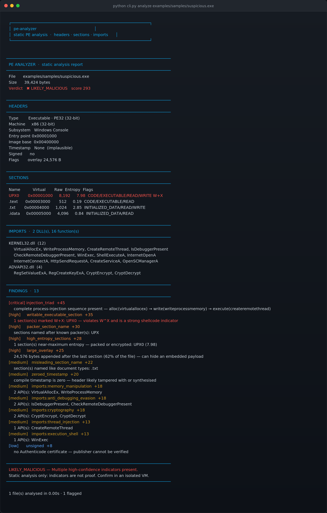
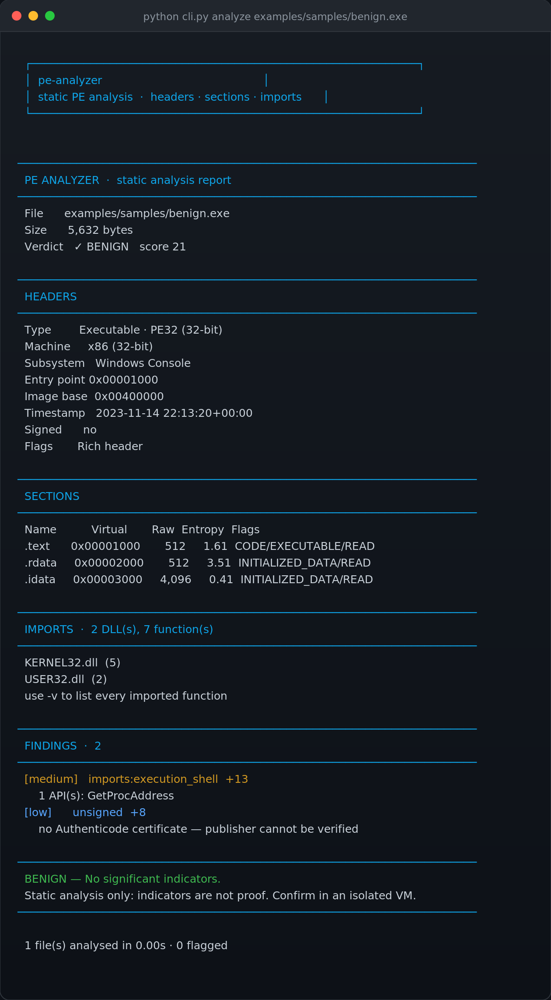

# 🔬 pe-analyzer

A **Windows PE (Portable Executable) analyser** built from scratch in Python — parses headers, sections, entropy and import tables directly from raw bytes using `struct`. No pefile, no LIEF, no third-party libraries.

> **Source code is private.** This repository is the public showcase: architecture, detection results and sample reports. Happy to walk through the implementation in an interview or on a call.

<p align="left">
  
  
  
  
  
</p>

---

## 🎯 Why this exists

Any tool can tell you a file is suspicious. Almost none tell you *why*, in a way an analyst can verify.

This project parses the PE format by hand to understand where every field actually lives — and then reasons about what those fields mean. Reading `e_lfanew` from a raw byte offset teaches you more about executables than any wrapper library ever will.

It's the second project in a series. The first was [**signature-scanner**](https://github.com/vinaynayak2007/signature-scanner) — that one detects whole files by hash; this one opens them up and looks inside.

---

## 📸 It running

**A suspicious sample — 13 findings, LIKELY MALICIOUS:**



**A benign sample — correctly left alone:**



**Full HTML report:** [`sample-report.html`](sample-report.html) · **Raw JSON:** [`sample-report.json`](sample-report.json)

---

## 🔍 What it extracts

| | |
| :--- | :--- |
| **Headers** | Machine type, PE32 vs PE32+, subsystem, entry point, image base, compile timestamp, DLL/system flags |
| **Sections** | Virtual/raw sizes, addresses, per-section **Shannon entropy**, characteristic flags (CODE, EXECUTABLE, WRITABLE…) |
| **Imports** | Full import table walked by hand — DLL names and every imported function via the thunk arrays |
| **Exports** | Exported function names from the export directory |
| **Directories** | All 16 data directories including certificate (Authenticode) and CLR/.NET |
| **Anomalies** | Overlay size, Rich header presence, zeroed or implausible timestamps |

### Commands

```
analyze <target>   full static analysis ( --html, --json, -v, -q )
info <file>        compact header summary
sections <file>    section table with entropy colouring
imports <file>     full import table grouped by DLL
```

**Exit codes:** `0` nothing flagged · `1` flagged · `2` usage error.

---

## 🧠 The findings engine

Eleven checks, each returning a **score and a plain-English reason**. Nothing is reported as a bare verdict, because a finding an analyst can't justify is a finding they won't trust.

### The injection triad

The most useful check. `VirtualAllocEx`, `WriteProcessMemory` and `CreateRemoteThread` are individually unremarkable — plenty of legitimate software uses them. **All three in one binary is the textbook sequence for injecting code into another process**, and is worth far more than the sum of its parts:

```
alloc(VirtualAllocEx) → write(WriteProcessMemory) → execute(CreateRemoteThread)
```

That combination alone scores +45.

### Full rule set

| Rule | Score | What it catches |
| :--- | :--- | :--- |
| `injection_triad` | 45 | Complete process-injection sequence |
| `writable_executable_section` | 35 | W+X sections — shellcode needs memory it can write *and* run |
| `packer_section_name` | 30 | UPX, ASPack, Themida, VMProtect, MPress, Enigma… |
| `high_entropy_sections` | 28 | Sections ≥7.2/8.0 — packed or encrypted |
| `large_overlay` | 25 | Data appended after the last section — hidden payload |
| `implausible_timestamp` | 25 | Compile date outside any sane range |
| `tiny_pe` | 25 | Files under 4 KB — loader stubs |
| `misleading_section_name` | 22 | Sections named `.txt`, `.jpg` — masquerading as documents |
| `zeroed_timestamp` | 20 | Timestamp reset — header rewritten |
| `imports:<capability>` | 8–30 | API groups: memory, injection, evasion, credentials, network, crypto |
| `imports:timing` | 3–8 | Timing APIs — deliberately low weight, see below |
| `unsigned` | 8 | No Authenticode certificate |

Verdict bands: `0–24 benign` · `25–49 interesting` · `50–79 suspicious` · `80+ likely_malicious`

### Tuning against false positives

Early versions flagged `GetTickCount` and `QueryPerformanceCounter` as anti-debugging at full weight — which meant **every profiler, benchmark and game engine** scored as suspicious. They're now their own low-weight category with an explicit note that they're present in most legitimate software.

That's the real work in detection engineering: a rule that fires on everything is worth nothing.

---

## 📊 Discriminating benign from suspicious

Both fixtures are generated by the included PE builder, so the comparison is reproducible:

| | `benign.exe` | `suspicious.exe` |
| :--- | :--- | :--- |
| **Verdict** | ✓ BENIGN | ✖ LIKELY MALICIOUS |
| **Score** | 21 | 293 |
| **Findings** | 2 (both low-weight) | 13 (1 critical, 4 high) |
| **W+X sections** | none | `UPX0` |
| **Highest section entropy** | 3.51 | 7.98 |
| **Compile timestamp** | 2023-11-14 | **zeroed** |
| **Overlay** | 0 B | 24,576 B (62% of file) |
| **Injection triad** | absent | **complete** |

A 14× score separation, with the benign binary correctly left unflagged. Tested explicitly in `test_suspicious_scores_much_higher_than_benign`.

---

## 🏗️ Building a PE from scratch

To test this analyser I needed PE files — but real malware must never be committed, and a Windows binary isn't always to hand. So `examples/build_demo_pe.py` **constructs valid PE files byte by byte**: DOS header, COFF header, optional header, section table, and a working import directory with real thunk arrays.

Writing a PE builder turned out to be the best possible way to learn the format — every field has to sit at exactly the offset the loader expects, or the file simply won't parse.

The fixtures are structurally valid PE images containing **no executable code**. They are analysis targets, not programs.

---

## ✅ Test suite

```
Ran 44 tests in 0.107s
OK
```

Covers entropy bounds, RVA→offset mapping, malformed-header rejection, section parsing, import resolution, every analysis rule, verdict thresholds, and report escaping.

Two categories worth calling out:

**A fuzzing check.** 60 randomly-sized blobs of random bytes are fed to the parser, and it must survive all of them without raising. A parser that crashes on a weird sample is useless precisely when you need it.

**A regression test.** The first version read import names straight from the `IMAGE_IMPORT_BY_NAME` RVA and produced `'\x19\x01ExitProcess'` — because that structure is `{ WORD Hint; CHAR Name[]; }`, so the name starts **two bytes in**. The test now asserts every imported name is printable and contains no control characters.

The suite also runs against a **real Windows executable** when one exists on the system (pip ships one), so the parser is validated against a genuine compiler's output, not just my own builder's.

---

## 🗂️ Architecture

```
cli.py                    argparse entrypoint — analyze / info / sections / imports
peanalyzer/
  parser.py               raw PE parsing with struct: DOS, COFF, optional
                          header, sections, imports, exports
  analysis.py             11 scored detection rules + verdict bands
  report.py               terminal, JSON and HTML renderers
examples/
  build_demo_pe.py        constructs valid PE fixtures from scratch
  samples/                generated benign.exe and suspicious.exe
tests/
  test_analyzer.py        44 tests including fuzzing and regressions
```

Parsing and analysis are deliberately separate: `parser.py` answers *what is in this file*, `analysis.py` answers *does any of it matter*. That split is what makes every rule independently testable.

---

## ⚠️ Limitations — stated honestly

- **PE32/PE32+ only.** 16-bit NE/LE and DOS executables are not supported.
- **Static analysis only.** Nothing is executed, so runtime behaviour — actual unpacking, actual network calls — is inferred, never observed.
- **No unpacking.** A UPX-packed binary is flagged, not unpacked. Unpacking is a separate discipline.
- **Import table depth is bounded.** The walk stops at 256 DLLs and 2,048 functions per DLL. Malformed files with circular thunk chains would otherwise loop forever.
- **Heuristics produce false positives.** Installers, debuggers, game anti-cheat and DRM all legitimately use APIs on this list. Scores are context, not proof.
- **The fixtures are synthetic.** They exercise every rule, but they are not real malware and don't represent how real malware is obfuscated.
- **Not a sandbox.** Never rely on static analysis alone to clear a file.

---

## 🗺️ Roadmap

- [ ] Resource directory parsing (icons, version info, embedded manifests)
- [ ] Authenticode certificate chain extraction and publisher identification
- [ ] Structured exception handler and exception directory analysis
- [ ] YARA rule matching against section data
- [ ] Import hash (imphash) computation for family clustering
- [ ] Rich header decoding to identify the build toolchain
- [ ] Diff mode — compare two builds of the same binary
- [ ] .NET IL analysis for managed assemblies

---

## ⚖️ Responsible use

Static analysis of files you own or are explicitly authorised to examine. This tool reads files and reports; it never executes them, and it creates nothing malicious.

Handle untrusted samples on an isolated machine, and treat every sample as live regardless of what a static tool says.

---

## 📄 License

MIT — documentation and sample reports in this repository are free to use and reference.

---

<p align="center"><sub>Built by <a href="https://github.com/vinaynayak2007">Vinay N</a> · Cyber Security @ Alliance University · <a href="https://vinunayak.pages.dev">vinunayak.pages.dev</a></sub></p>
